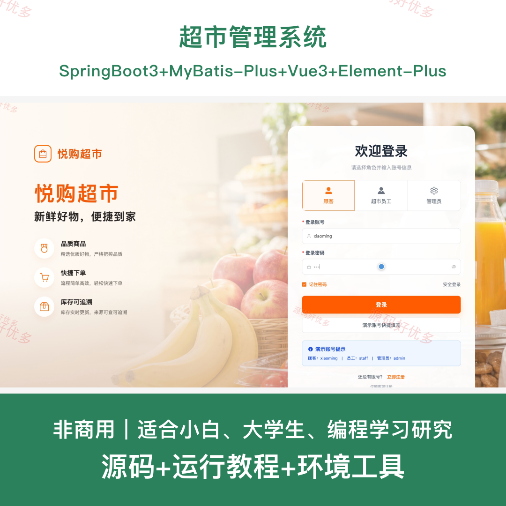
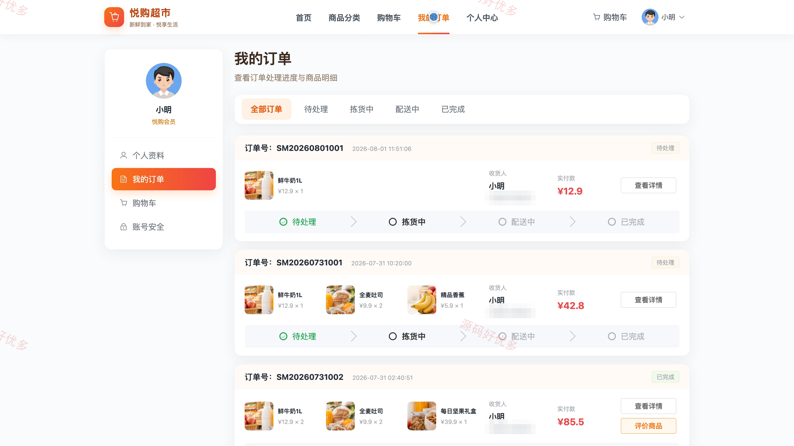
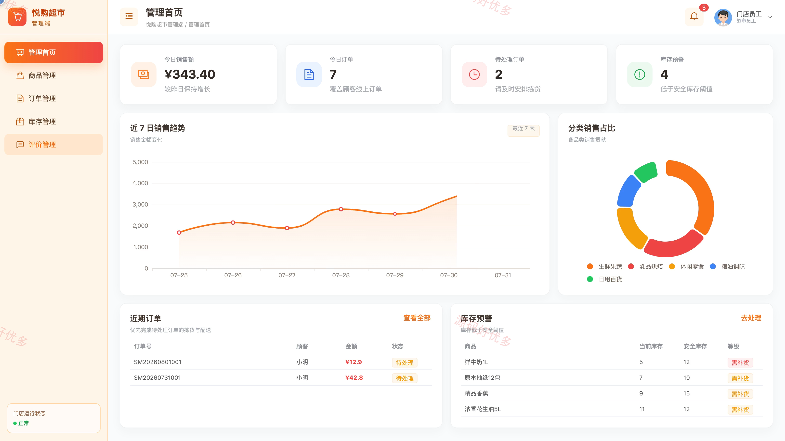
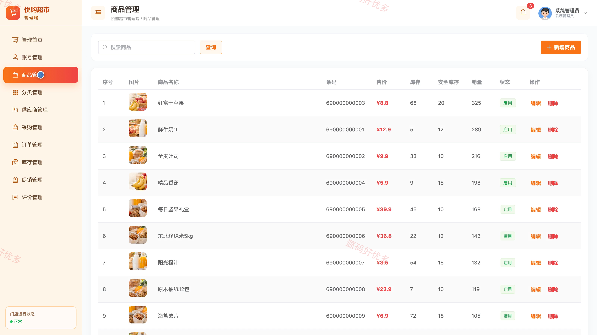
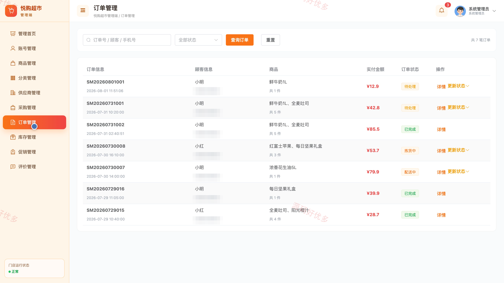
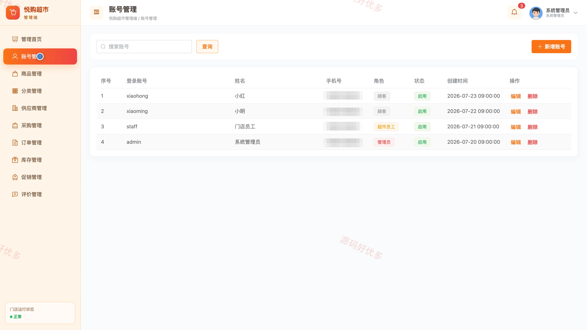

# bs015A
bs015A超市管理系统
## 源码问题查看主页咨询

### 一、关键词
超市管理系统、便利超市、线上商城、商品选购、超市购物

### 二、作品包含
源码+数据库+全套环境和工具资源+本地部署教程

### 三、项目技术
前端技术： Html、Css、Js、Vue3.4、Element-Plus
后端技术：Java、SpringBoot3.2.0、MyBatis-Plus

### 四、运行环境（以下版本亲测，其他版本兼容性请自行测试）
开发工具：IDEA/eclipse + VSCODE

数据库：MySQL5.7+（共14张表）

数据库管理工具：Navicat10以上版本

环境配置软件： JDK17 + Maven3.6.3

前端Nodejs：16+

浏览器：谷歌浏览器

### 五、项目介绍
项目编号：bs015A

超市管理系统面向管理员、员工、客户，提供商品分类选购、购物车结算、订单配送跟踪、商品评价、库存预警、采购入库、供应商管理和促销活动等功能，实现线上商城购物与超市后台运营的一体化管理。

角色：管理员、员工、客户

管理员功能：管理首页查看销售趋势与分类销售占比数据看板、维护顾客员工管理员账号并分配角色与启停用、商品新增编辑上下架与价格库存图片维护、商品分类新增编辑与排序启停用管理、供应商资料维护与采购单创建及入库确认、按订单号或顾客手机号查询订单并推进拣货配送完成、库存预警处理与入库登记及变动记录查看、商品折扣促销配置与顾客评价回复显示控制。

员工功能：管理首页查看销售统计与近期订单及库存预警、商品新增编辑上下架与库存维护、订单查询与拣货配送完成状态更新、库存预警处理与入库登记及变动记录查看、顾客评价回复与显示状态控制。

客户功能：注册顾客账号并登录商城、浏览首页热门分类与本周精选商品、按分类筛选商品并查看价格库存与促销信息、商品加入购物车并勾选结算修改数量或删除、填写收货人电话与收货地址后确认下单、按状态筛选我的订单并查看商品明细与配送进度、对已完成订单的商品进行评分与评价、个人中心维护资料与默认收货地址并修改密码。

### 六、运行截图

